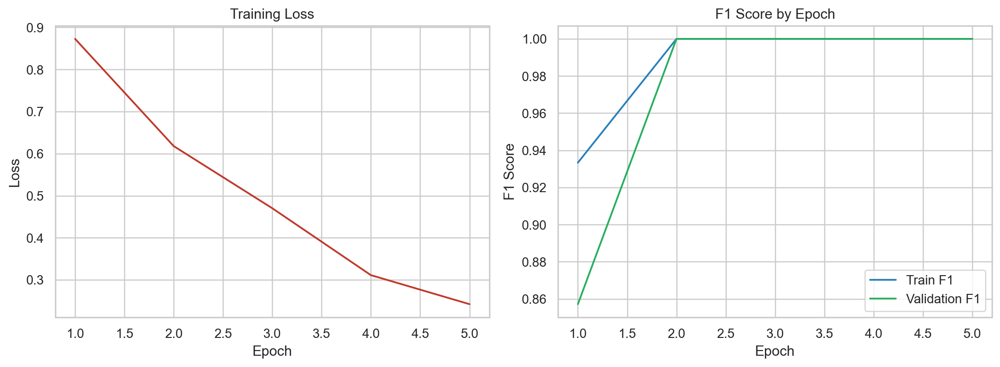
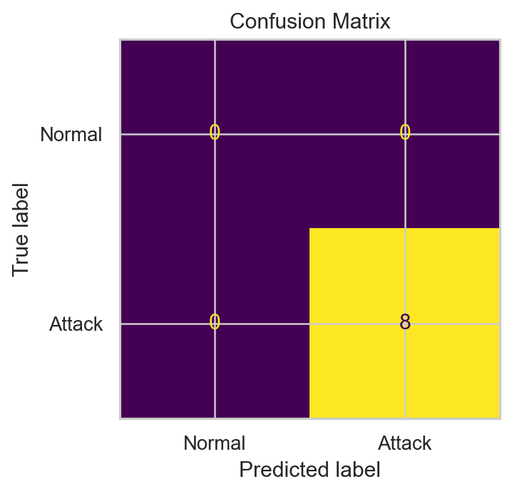

# GNN-Based Network Intrusion Detection System


An end-to-end final year project that detects suspicious network behavior by converting traffic flows into graphs and training Graph Neural Networks to identify malicious hosts automatically.

## Problem It Solves

Modern networks contain many interconnected devices, and attacks like DDoS, reconnaissance, botnet coordination, and malicious lateral movement often appear as relationship patterns, not just suspicious single rows of data.

Traditional machine learning models usually inspect traffic records independently. This project solves that limitation by modeling the network as a graph:

- Nodes = IP addresses or hosts
- Edges = communication between hosts
- Output = suspicious node prediction

Because a Graph Neural Network learns from both host features and neighboring behavior, it is better suited for connected attack patterns than flat-row classifiers.

## Project Overview

This system:

- loads raw traffic CSV data
- normalizes columns such as source IP, destination IP, bytes, packets, duration, and label
- builds a graph from host communications
- aggregates node-level traffic behavior
- trains `GCN`, `GraphSAGE`, or `GAT`
- evaluates model performance with metrics and plots
- ranks suspicious hosts during inference
- provides a Streamlit dashboard for visual demo

## Tech Stack

- `Python` for the full implementation
- `PyTorch` for deep learning
- `PyTorch Geometric` for graph neural network layers and graph data handling
- `Pandas` for CSV processing and feature preparation
- `scikit-learn` for scaling, train/test splits, and metrics
- `Matplotlib` and `Seaborn` for evaluation visuals
- `Streamlit` for the interactive dashboard

## Dataset Used

The project supports:

- synthetic dataset generation for guaranteed demo and testing
- real CSV traffic datasets such as CICIDS-style exports after column mapping

Expected logical fields:

- `src_ip`
- `dst_ip`
- `bytes`
- `packets`
- `duration`
- `label`

The preprocessing layer auto-detects common alternate column names such as `Source IP`, `Destination IP`, `Flow Duration`, and `Label`. Text labels like `BENIGN` are converted to `0`, while attack labels are converted to `1`.

## Workflow

1. Collect or load network traffic CSV data.
2. Normalize the dataset schema.
3. Convert traffic into a graph.
4. Generate node features from incoming and outgoing activity.
5. Train a GNN model for node classification.
6. Evaluate with accuracy, precision, recall, F1-score, confusion matrix, and ROC curve.
7. Run inference to rank suspicious nodes.

## Models Used

- `GCN` for baseline graph convolution
- `GraphSAGE` for scalable neighborhood aggregation
- `GAT` for attention-based neighborhood weighting

## Repository Structure

```text
finalyearproject/
|-- app.py
|-- data/
|-- models/
|-- reports/
|-- src/gnn_ids/
|   |-- artifacts.py
|   |-- data.py
|   |-- infer.py
|   |-- models.py
|   |-- train.py
|   `-- utils.py
|-- requirements.txt
`-- README.md
```

## Installation

```bash
python -m venv .venv
.venv\Scripts\activate
pip install -r requirements.txt
```

## Run The Project

Train on synthetic data:

```bash
python -m src.gnn_ids.train --dataset synthetic --epochs 20
```

Run inference:

```bash
python -m src.gnn_ids.infer --input data/synthetic_flows.csv --checkpoint models/gnn_ids.pt
```

Launch the dashboard:

```bash
streamlit run app.py
```

Train with a real CSV:

```bash
python -m src.gnn_ids.train --dataset csv --csv-path data/your_dataset.csv --model gat --epochs 30
```

## Dashboard and Output Screenshots

### Training Curves



### Confusion Matrix



## Output Files

After training, the project generates:

- `models/gnn_ids.pt`
- `models/scaler.joblib`
- `models/metadata.json`
- `reports/metrics.json`
- `reports/training_history.csv`
- `reports/node_predictions.csv`
- `reports/inference_results.csv`
- `reports/confusion_matrix.png`
- `reports/training_curves.png`
- `reports/roc_curve.png` when both classes are present in evaluation
- `reports/classification_report.txt`

## Academic Use

This repository is suitable for:

- final year project submission
- viva presentation and demonstration
- graph-based intrusion detection research prototype
- cybersecurity and GNN learning projects

The repo also includes:

- project report content in `reports/PROJECT_REPORT.md`
- a generated presentation in `reports/GNN_IDS_Final_Presentation.pptx`

## Future Scope

- real-time packet capture integration
- temporal GNNs for time-aware attack detection
- explainable AI for analyst-friendly outputs
- edge classification for malicious flow detection
- SOC/SIEM integration for operational deployment

## Notes

- `torch-geometric` should match your local PyTorch environment
- synthetic mode is useful for demo when a public dataset is not locally available
- the tested run in this repo generated evaluation outputs successfully
